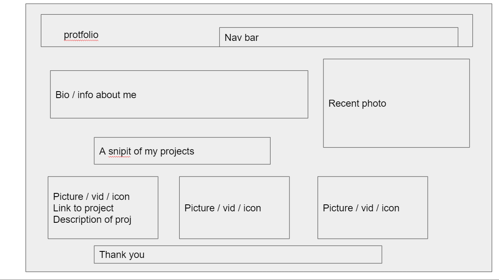

# Professional Portfolio Project

## About this project
    This project is to create a responsive portfolio. this site must have working nav links and showcase examples of recent/future projects. 
- [Professional Portfolio Project](#professional-portfolio-project)
  - [About this project](#about-this-project)
  - [Website link and screenshot](#website-link-and-screenshot)
      - [Portfolio link](#portfolio-link)
      - [Planned website vs Outcome](#planned-website-vs-outcome)
  - [Recources](#recources)
  - [REQUIREMENTS](#requirements)
  - [PROCESS TO COMPLETE REQUIREMENTS](#process-to-complete-requirements)
  - [Contributors](#contributors)
  

## Website link and screenshot
#### Portfolio link
[Click me!](https://nbrown225.github.io/ChristinaBrown/)
#### Planned website vs Outcome

 "Finished Product")

## Recources
- Github
- Gitbash
- VS Code
- Google
- W3 Schools
- Google Slides
  

## REQUIREMENTS
1. Name and recent photo/icon
2. Working navigation and links to:
- about me
- recent work
- contact me
3. When clicking on links in recent work section, it takes the user to that section
4. First image of recent work should be larger than the rest!
5. RECENT WORK MUST HAVE A LINK THAT TAKES USER TO DEPLOYED SITE
6. Must have a responsive layout


## PROCESS TO COMPLETE REQUIREMENTS
Name and photo
- ```<h1><span>CHRISTINA BROWN</span></h1>```
- ``````
  
Navigation links
- Example: About me section in the nav bar
  - ```<a href="#about-me">ABOUT ME add underline</a>```
  - also added ```<section id="about-me">``` to for each section. this way the link goes to the correct section of the page when clicked
  
First image of recent work should be larger than the rest!
  -  I changed the first image to be larger than the rest in the recent work section
```width: 250px; height: 230px;```

RECENT WORK MUST HAVE A LINK THAT TAKES USER TO DEPLOYED SITE
  - In order to add an image that opens to the deployed website, I added an ```<a>``` with an `````` inside of it
  ```<a href="https://lernantino.github.io/run-buddy/"></a>```

Must have a responsive layout
  - To make sure the layout moved when resizing the browser or opening different sized browsers, I made sure to include ```<display: flex>``` to the parent elements, and ```<flexwrap: wrap>``` to the child

## Contributors
- Christina Brown


